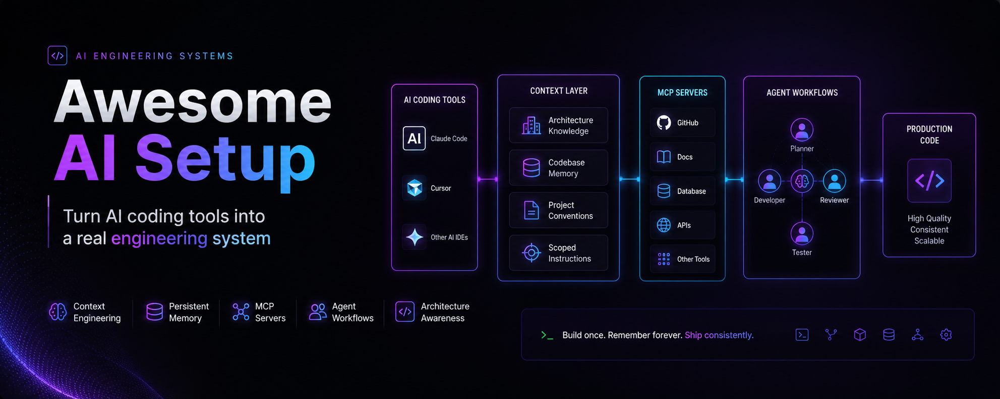

<div align="center">



# Awesome AI Setup
> Turn AI coding tools into a real engineering system.

Claude Code • Cursor • MCP • Memory • Context Engineering • Agent Workflows • Architecture Awareness

<p>
  <a href="#quick-start">Quick Start</a> •
  <a href="#whats-in-this-repo">What's in This Repo</a> •
  <a href="#the-agents">The Agents</a> •
  <a href="#ai-maturity-model">AI Maturity Model</a> •
  <a href="#docs">Docs</a>
</p>

<p>
  <a href="https://www.linkedin.com/in/shuchita-jain/"></a>&nbsp;
  <a href="https://medium.com/@coderSJ"></a>
</p>


</div>

---

Practical agents and patterns for AI-native repository workflows.

This is not a prompt collection. It's a structured approach to context engineering - using AI itself to analyze your repository and generate accurate, project-specific documentation that makes AI coding assistants significantly more effective.

---

## The Core Idea

Most AI setup guides give you static files to copy. The problem: static files describe a hypothetical project, not yours.

This repository takes a different approach.

**The AI assistant is the execution engine.** Instead of shipping a static `ARCHITECTURE.md` for you to adapt, this repo ships an agent that instructs your AI assistant to analyze your actual codebase and generate an accurate `ARCHITECTURE.md` from what it finds.

```
# Instead of this:
copy examples/flutter/ARCHITECTURE.md → your-project/ARCHITECTURE.md
# and manually adapt 300 lines of template...

# You do this:
"Read agents/generate-architecture.md and execute it on this repository."

# AI inspects your actual folder structure, detects your patterns,
# infers your conventions, and generates an accurate file.
```

The result is documentation that reflects your real project - not a generic ideal.

---

## Why This Matters

**Static templates rot.** A copied `ARCHITECTURE.md` is accurate on day one, stale by month three. Agents can be re-run whenever your architecture evolves.

**Works across tools.** Plain markdown files, compatible with Claude Code, Cursor, Copilot, Codex, Aider, and anything else that can read a file. No vendor lock-in, no tool-specific syntax.

**Infer, don't invent.** Every agent has a "Do NOT" section. Hallucination constraints are as important as generation instructions. Output is derived from your actual code, not a template.

**Composable.** Run one agent or all seven. The files work independently.

---

## What's in This Repo

```
awesome-ai-setup/

agents/               # 7 executable AI agents (the core product)
  README.md           # invocation reference for all agents and tools
  *.md                # one file per agent

docs/
  MATURITY_MODEL.md
  CONTEXT_ENGINEERING.md
  MCP_GUIDE.md

examples/
  flutter/            # Flutter + Riverpod + Clean Architecture reference output
  nodejs/             # Node.js + Express + TypeScript reference output
```

---

## Quick Start

### Step 1 - Install the agents into your project

Run this from your project root. It copies the `agents/` folder and asks which tools you use.

```bash
npx awesome-ai-setup
```

### Step 2 - Run the diagnostic

Start here regardless of where you are: fresh project, existing project with no AI setup, or existing project with a partial setup.

**Claude Code**
```
Read agents/diagnose-and-setup.md and execute it on this repository.
```

**Cursor**
```
@.cursor/commands/diagnose-and-setup.md - execute this on the current codebase
```

**GitHub Copilot (VS Code)**

Open Copilot Chat, click the agent picker (mode dropdown), select **diagnose-and-setup**, then send:
```
execute the diagnostic on this codebase
```

The diagnostic produces a short, prioritized action plan tailored to your current state: fresh project, no AI setup, or partial setup.

### Step 3 - Follow the generated action plan

Run the recommended agents in the same tool. For Claude Code and Cursor, swap the filename. For Copilot, select the agent from the picker. Review each output before committing - agents mark uncertain sections with `<!-- TODO: verify -->` for human review.

### Using an example as reference

On existing projects (where `src/`, `lib/`, or `app/` exists), the CLI will offer to copy an example during setup. You can also browse `examples/` directly at any time to see what high-quality agent output looks like for a specific stack.

Current examples:

| Example | Stack |
|---------|-------|
| `flutter` | Flutter, Riverpod 2.x, Clean Architecture, GoRouter, Freezed |
| `nodejs` | Node.js 22, Express 5, TypeScript (strict), Prisma, Zod, Vitest |

---

## The Agents

| Agent                          | What It Generates                                   | When to Use                                  |
|--------------------------------|-----------------------------------------------------|----------------------------------------------|
| `diagnose-and-setup`           | Prioritized action plan                             | **Start here** - any project, any stage      |
| `generate-architecture`        | `ARCHITECTURE.md`                                   | Active codebase setup, after major refactors |
| `generate-context`             | `CONTEXT.md`                                        | Active codebase setup, when domain evolves   |
| `update-memory`                | `MEMORY.md`                                         | After architectural decisions, migrations    |
| `generate-scoped-instructions` | `.github/instructions/*.instructions.md`, `.github/copilot-instructions.md` | Any stage - works with minimal code          |
| `generate-mcp-config`          | `.mcp.json`, `.cursor/mcp.json`, `.vscode/mcp.json` | When adding tool connections (Level 3)       |
| `generate-agent-workflows`     | `AGENTS.md`, `workflows/`                           | After Levels 1–4 are in place                |

→ [Agents documentation](agents/README.md)

---

## AI Maturity Model

Use this as a diagnostic, not a checklist.

| Level | What You Have                                   | Next Step                                                                             |
|-------|-------------------------------------------------|---------------------------------------------------------------------------------------|
| **0** | AI autocomplete, no project context             | Run `diagnose-and-setup`                                                              |
| **1** | Instructions file (`CLAUDE.md`, `.cursorrules`) | Add `ARCHITECTURE.md` + `CONTEXT.md` via `generate-architecture` + `generate-context` |
| **2** | Architecture + domain context                   | Add MCP config via `generate-mcp-config`                                              |
| **3** | Tool-connected (MCP)                            | Add `MEMORY.md` via `update-memory`                                                   |
| **4** | Memory-aware                                    | Add agentic workflows via `generate-agent-workflows`                                  |
| **5** | Agentic workflows                               | -                                                                                     |

→ [Full maturity model](docs/MATURITY_MODEL.md)

---

## Docs

- [How to use the agents](agents/README.md)
- [AI Maturity Model](docs/MATURITY_MODEL.md)
- [Context Engineering Guide](docs/CONTEXT_ENGINEERING.md)
- [MCP Integration Guide](docs/MCP_GUIDE.md)

---

*These patterns reflect what's working in production today. The AI tooling ecosystem is moving fast - the agent-driven approach is specifically designed to stay useful as capabilities evolve.*
